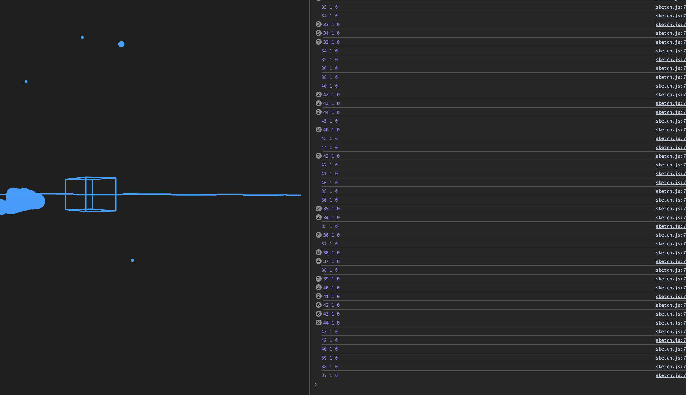

# Music Visualiser Project


## 😬 Introduction

For this project, we were tasked with creating a visualiser. We decided to use 


in order to visualise this.

We also use FFT to get the audio in as well as to analyze the waveform.


Additionally , to add additional dynamics or flavour to the visualiser, we also obtain various "energies" of the audio. 

```
    let rawBass = fft.getEnergy("bass");
    let rawMid = fft.getEnergy("mid"); 
    let rawTreble = fft.getEnergy("highMid");
```

## 🛠️ Hyperparameters

There are numerous hyperparameters or "settings" that are adjustable to modify the visualisations.

```
let sceneRotationalFactor = 0.05;
let colorOffset = 0; 

let BASS_NOISE_GATE = 20;  // Higher threshold for bass
let MID_NOISE_GATE = 20;
let TREBLE_NOISE_GATE = 3;
let BASS_SMOOTHING_FACTOR = 1; // Higher = more smoothing (0-1)
let MID_SMOOTHING_FACTOR = 0.8; // Higher = more smoothing (0-1)
let TREBLE_SMOOTHING_FACTOR = 1; // Higher = more smoothing (0-1)

let rawBassGainFactor = 0.6;
let rawTrebleGainFactor = 1.5;
```

## 📘 Implementation Methodology

Whilst trying to get the shapes to be as responsive as possible, we faced the issue that certain frequencies were being picked up at a higher sensitivty than others.  

```  console.log(bassEnergy, midEnergy, trebleEnergy); ```




<div class="alert alert-info">
        We logged out the energy of each frequency and found that the bass was being picked up at a higher sensitivity than the mid and treble.
        <br />As such we decided to implement the following methods to address this
        
</div>


### 🎧⾨ Noise Gate

```
    smoothedBass = smoothedBass < BASS_NOISE_GATE ? 0 : smoothedBass;
    smoothedMid = smoothedMid < MID_NOISE_GATE ? 0 : smoothedMid;
    smoothedTreble = smoothedTreble < TREBLE_NOISE_GATE ? 0 : smoothedTreble;
```

- In order to get a more "consistent" visualisation and preventing the pickup of unintended sounds, we decided to implement a noise gate, it is a threshold that is used to prevent the pickup of undesired audio.


### ❄️ Smoothing & Gain Factor

```
    // Treble and Bass Modifications ( Gains )
    rawTreble = rawTreble * rawTrebleGainFactor;
    rawTreble = constrain(rawTreble, 0, 255);
    rawBass = rawBass * rawBassGainFactor;
    rawBass = constrain(rawBass, 0, 255); 
    
    // Exponential scaling to reduce sensitivity
    rawBass = pow(rawBass/255, 2) * 255;
    rawMid = pow(rawMid/255, 2) * 255;
    rawTreble = pow(rawTreble/255, 2) * 255;
    
    // Smoothing
    smoothedBass = lerp(smoothedBass, rawBass, BASS_SMOOTHING_FACTOR); // SMOOTH BATH MORE AGGRESIVELY
    smoothedMid = lerp(smoothedMid, rawMid, MID_SMOOTHING_FACTOR);
    smoothedTreble = lerp(smoothedTreble, rawTreble, TREBLE_SMOOTHING_FACTOR);
```

- Added gain factors to the bass and treble levels 
        - Gain values were hypersensitive
        - Treble values were too low. Undetected even sometimes.

- Smoothing was added to the bass, mid and treble levels for a "smoother effects"


##  🎼 Sound Compositions depicting some of the Shapes


### 📦 Box In Center

Its height, width and depth are mapped to the bass, mid and treble energy respectively.
```
        let boxWidth = map(bassEnergy, 0, 255, 50, 300);
        let boxHeight = map(midEnergy, 0, 255, 50, 300);
        let boxDepth = map(trebleEnergy, 0, 255, 50, 300);
```


### 🍩 Torus 

```
        let angle = map(i, 0, spectrum.length, 0, TWO_PI);
        let radius = map(spectrum[i], 0, 255, 100, 400);
        
        let x = radius * cos(angle);
        let y = radius * sin(angle);
        let z = map(spectrum[i], 0, 255, -200, 200);
```

- Torus is mapped to the spectrum as a whole. Not adjusted specifically,
meant to take more of the audio as a "whole".

### ⌇ Line 

```
    beginShape();
    for (let i = 0; i < waveform.length; i++) {
        let line_x = map(i, 0, waveform.length, -width / 2, width / 2);
        let line_y = map(waveform[i], -1, 1, -height / 4, height / 4);
        vertex(line_x, line_y, 0);
    }
    endShape();
    pop();
```

- Based on waveform rather than the frequency bands of the spectrum.


### 🔮 Random Spheres 

```
  for (let i = 0; i < 3; i++) {
        push();
        let rx = random(-width / 2, width / 2);
        let ry = random(-height / 2, height / 2);
        let rz = random(-500, 500);
        translate(rx, ry, rz);
        let size = map(trebleEnergy, 0, 255, 2, 20);
        
        let trebleHue = (colorOffset + map(trebleEnergy, 0, 255, 0, 360)) % 360;
        colorMode(HSB);
        stroke(
            trebleHue, 
            trebleHue, 
            trebleHue
        );
        ambientMaterial(trebleHue, 100, 100);
        
        sphere(size);
        pop();
    }
```

- Meant to represent the "treble" energy.


## Useful References


1. [FFT Energy Reference](https://editor.p5js.org/rios/sketches/IazTFSKSt)